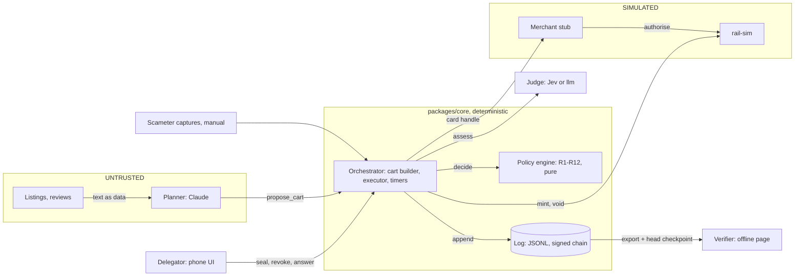
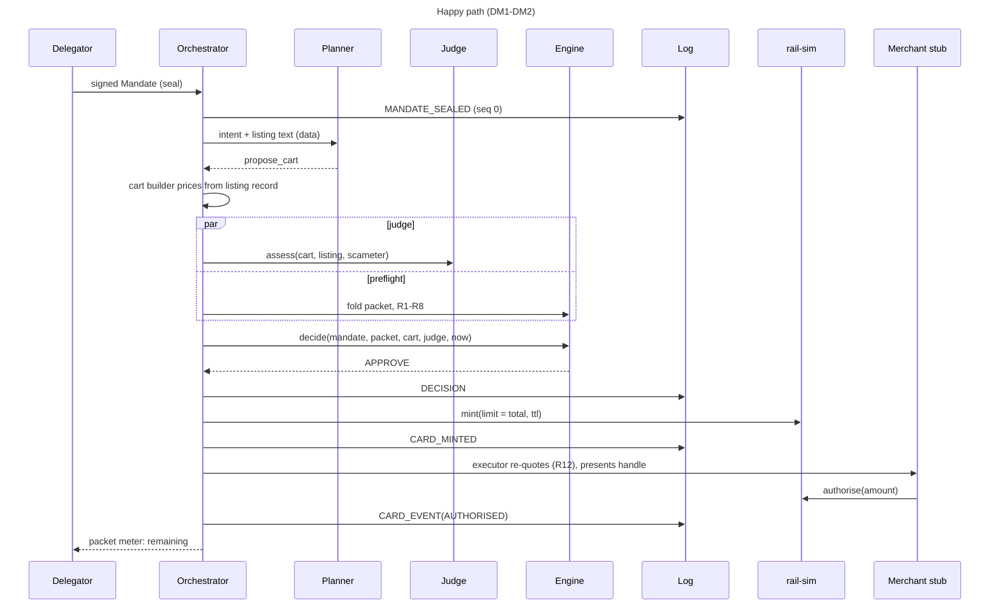
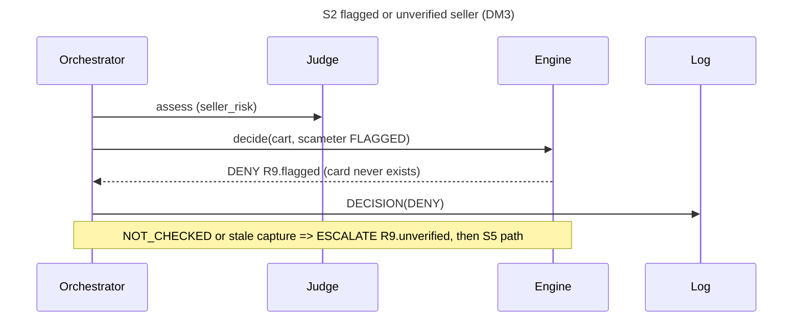
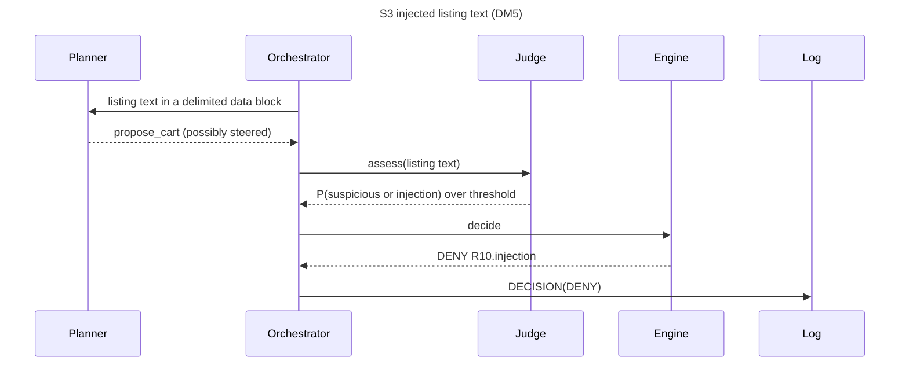
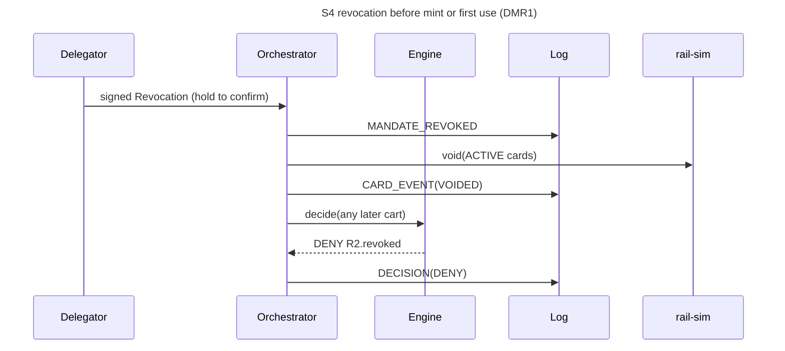
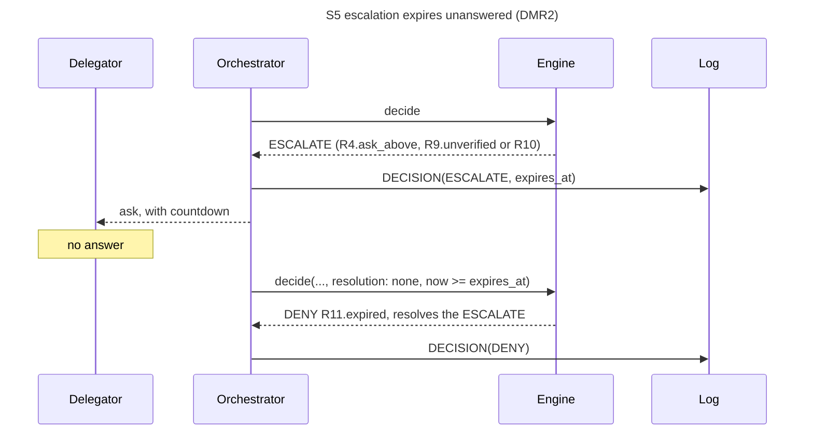
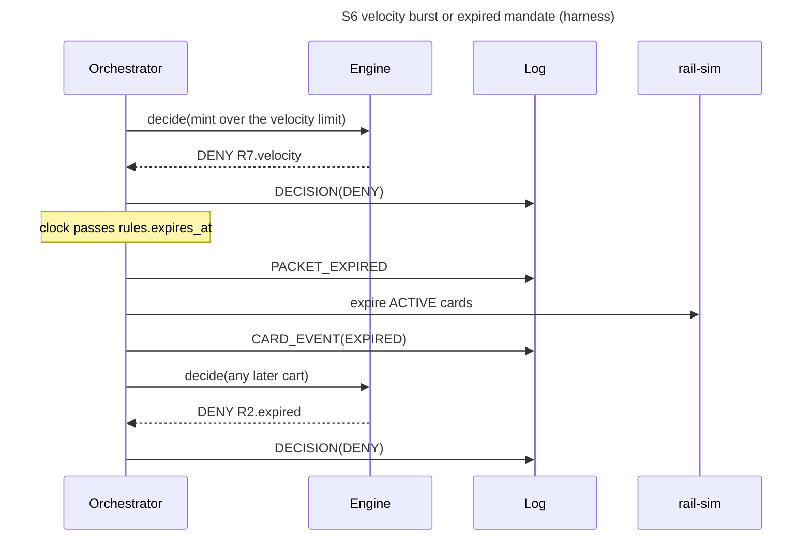

# 02 Architecture

- **Rail is SIMULATED** throughout. Not affiliated with HKT, Tap & Go or Mastercard.

## 1. Context



- **Single writer**: one orchestrator queue per packet.

## 2. Sequences



```mermaid
sequenceDiagram
  title S1 over budget incl. shipping/FX (DM4; overshoot beat in DM2)
  participant O as Orchestrator
  participant E as Engine
  participant L as Log
  participant R as rail-sim
  participant M as Merchant stub
  O->>E: decide(total incl. shipping > remaining)
  E-->>O: DENY R3.over_remaining (no card)
  O->>L: DECISION(DENY)
  Note over O,M: after a mint, checkout re-quote differs
  O->>E: decide(re-quoted cart, resolves APPROVE)
  E-->>O: DENY R12.price_drift
  O->>L: DECISION(DENY)
  O->>R: void(card)
  O->>L: CARD_EVENT(VOIDED)
  Note over M,R: merchant overshoot mode charges above the limit
  M->>R: authorise(amount > limit)
  R-->>O: DECLINED OVER_LIMIT (limit held)
  O->>L: CARD_EVENT(DECLINED)
```











## 3. Components

| Component | Package | Responsibility |
|---|---|---|
| **Orchestrator** | core | Pipeline contract, per-packet queue, timers (R11, TTL, expiry), head checkpoint |
| **Cart builder** | core | `propose_cart` → Cart, priced from the listing record incl. shipping, fees, FX [F3] |
| **Executor** | core | Checkout: re-quote (R12), present the handle, record CARD_EVENT |
| **Policy engine** | core | Pure `decide` over R1-R12; `foldPacket`; template renderers |
| **Log + crypto** | core | JCS, SHA-256, Ed25519, did:key; `appendEntry`, `verifyChain` |
| **Planner** | agent | Claude, one tool |
| **Judge adapters** | agent | `JudgePort` for jev and llm, shadow wrapper |
| **rail-sim** | rail-sim | `RailPort` + merchant stub, F1 semantics |
| **Web** | apps/web | React UI, thin Node API, SSE live trace; composes ports |
| **Verifier** | apps/verifier | Static offline page |
| **Harness** | harness | Seeded replays through the same ports ([05](05-evidence-plan.md)) |

## 4. Trust boundaries

| Component | Can | Cannot |
|---|---|---|
| **Planner** | read intent, rules summary, listing text; call `propose_cart` | see keys, handle, PAN/CVV or log; set money fields; decide |
| **Judge** | return option probabilities | browse, plan, write; loosen a decision (I3) |
| **Engine** | return a Decision | do I/O, read a clock, mint |
| **Orchestrator** | sign entries, call the rail | mint without a logged APPROVE (I1); edit a Decision |
| **rail-sim** | mint, void, authorise under F1 rules | exceed ceiling or max active [F1]; emit PAN/CVV |
| **Delegator** | seal, revoke, answer escalations | override hard rules by answering |
| **Verifier** | check entries, keys, checkpoint | trust the operator; go online |

## 5. Invariants

| ID | Enforcement point | Test |
|---|---|---|
| I1 | Mint only after an appended APPROVE; `RailPort.mint` rejects non-APPROVE or reused decisions | T-I1 |
| I2 | Engine sets `approved_limit_minor = cart.total_minor` only if R3 and R5 pass; rail-sim mints exactly that | T-I2 |
| I3 | Judge enters only via R10 (verdicts DENY/ESCALATE); outcome = max severity | T-I3 (property) |
| I4 | Planner env: `ANTHROPIC_API_KEY` only; tools `[propose_cart]`; lint bans `agent` importing signing or rail-sim | T-I4 |
| I5 | Typed port failures under timeouts [F33, F34]; judge failure → `R10.unavailable`; rail or engine error → no card | T-I5 (fault injection) |
| I6 | R2; revoke voids ACTIVE cards; queue orders revoke against mint | T-I6 |
| I7 | `appendEntry` before side effects; one DECISION per decide | T-I7, T-V1 |
| I8 | No PAN/CVV/expiry fields (`additionalProperties: false`); CI scans logs, fixtures, prompts for Luhn-valid digit runs and "cvv" | T-I8 |

## 6. Data model

- **Source of truth**: `schemas/` (draft 2020-12); shared primitives in `mandate.schema.json#/$defs`. Money = integer HKD cents; time = RFC 3339 UTC; hashes = hex SHA-256; signatures and keys = base64url, unpadded.

| Schema | AP2 analogue [F12] | Producer | Logged as |
|---|---|---|---|
| Mandate | Intent mandate | delegator | `MANDATE_SEALED` |
| Cart | Cart mandate | cart builder | inside `DECISION` |
| Decision | payment-mandate evidence | engine | `DECISION` |
| CardRecord | payment-mandate evidence | rail-sim | `CARD_MINTED` |
| LogEntry | none | orchestrator | every line |
| PacketState | none | `foldPacket` | never stored |

- **Packet accounting**: commit the limit on `CARD_MINTED`; release on `VOIDED`/`EXPIRED`; `AUTHORISED` moves the actual amount to spent and releases the rest. `budget = committed + spent + remaining`.
- **Resolution**: an answer, R11 expiry or R12 drift creates a new Decision with `resolves`.
- **Idempotency**: fingerprint = SHA-256(JCS(cart minus `id`, `proposed_at`)); a repeat while its card is ACTIVE returns the earlier Decision.

## 7. Rule catalogue

| ID | Inputs | Pass when | On fail | Module `core/src/rules/` |
|---|---|---|---|---|
| R1 | mandate, delegator key | signature verifies | DENY `R1.invalid_signature` | `mandate.ts` |
| R2 | revocations, `expires_at`, now | not revoked, not expired | DENY `R2.revoked`, `R2.expired` | `mandate.ts` |
| R3 | total, remaining | total <= remaining | DENY `R3.over_remaining` | `money.ts` |
| R4 | total, `per_purchase`, remaining | total <= cap and <= `ask_above` | DENY `R4.over_cap`; ESCALATE `R4.ask_above` | `money.ts` |
| R5 | total, ceiling [F1] | total <= ceiling | DENY `R5.over_ceiling` | `money.ts` |
| R6 | domain, item categories | allowed, not denied, categories listed | DENY `R6.off_mandate` | `scope.ts` |
| R7 | `mint_times`, limit [F32] or override | mints in window < max | DENY `R7.velocity` | `rate.ts` |
| R8 | active cards, max [F1] | active < max | DENY `R8.max_active` | `rate.ts` |
| R9 | Scameter state, capture age [F52] | not FLAGGED; captured and fresh if required | DENY `R9.flagged`; ESCALATE `R9.unverified` | `seller.ts` |
| R10 | JudgeRecord, profile | under thresholds (§9) | DENY or ESCALATE | `judge.ts` |
| R11 | escalation, window [F31] | answered in time | DENY `R11.expired` | `escalation.ts` |
| R12 | approved cart, checkout re-quote | prices equal | DENY `R12.price_drift` + void | `drift.ts` |

- **Hard rules** R1-R8, R12 survive any answer; only R4 `ask_above`, R9 unverified, R10 ESCALATE are answerable. Outcome: any DENY, else any ESCALATE, else APPROVE.

## 8. Explanation templates

- **Format** `<rule>.<variant>`; `render(templateId, inputs, locale)` is pure: no I/O, clock or LLM.
- **Primary reason**: first FAIL in rule order whose verdict equals the outcome. A delegator DENY reuses the escalating rule's template.
- **IDs**: full list in [00-context](00-context.md) (Stops).
- **Example**: `R3.over_remaining` → "Stopped by R3. Total HK$550 is over the HK$541 left." [F22]

## 9. Judge adapter

| Question | Options | Metric | jev [F36, F50] | llm [F51] | Effect |
|---|---|---|---|---|---|
| `scope_fit` | in_scope, out_of_scope | P(in_scope) | < 0.60 | < 0.75 | ESCALATE `R10.scope` |
| `injection_risk` | clean, suspicious, injection | P(suspicious) + P(injection) | >= 0.20 | >= 0.10 | DENY `R10.injection` |
| `seller_risk` | low_risk, high_risk | P(high_risk) | >= 0.50 DENY, >= 0.25 ESCALATE | 0.35, 0.15 | `R10.seller_risk` |
| `escalate_or_proceed` | proceed, escalate | P(escalate) | >= 0.50 | >= 0.30 | ESCALATE `R10.escalate` |

- **Contract**: `assess` never throws; JudgeRecord carries `status` (OK, TIMEOUT, ERROR), provider, model, version, MEASURED `latency_ms`. Questions run in parallel under the F34 timeout.
- **Inputs**: intent, rules, cart, listing text as delimited data, Scameter state.
- **Jev**: `@typesafe-ai/sdk`; one `systemOne` request carries the four Choice questions; model `jev-1.13.0` pinned [F11b]. SDK defaults (10 s, 2 retries) exceed F34: set the timeout to F34, retries 0.
- **llm fallback**: Anthropic SDK, structured outputs (`output_config.format`); verbalised, uncalibrated probabilities, hence the stricter F51 profile. Runs without a Jev key (H2 [F41]) or after a Jev failure.
- **Fail closed**: both fail → ESCALATE `R10.unavailable`.
- **Shadow** (`JUDGE_MODE=shadow`): R10 SKIPPED with `inputs.shadow_verdict`, outcome unaffected. Default until tuned; demo runs `enforce`.
- **Config**: thresholds in `core/src/config.ts` with register IDs; `engine.config_sha256` pins them.

## 10. Rail simulator (SIMULATED)

| F1 semantic | rail-sim behaviour |
|---|---|
| Virtual prepaid card, unique number, expiry, CVV | `handle` + random `last4` only; no PAN, CVV or printed expiry exist (I8) |
| Limit set by user, ceiling HK$2,000 [F1] | Limit = approved total (I2); above ceiling → `OVER_CEILING` |
| Max 2 active [F1] | Extra mint → `MAX_ACTIVE` |
| Validity <= 2 months [F1] | TTL = min(F30, mandate expiry, F1 validity); longer → `TTL_TOO_LONG` |
| Credentials end after one successful payment [F1] | First AUTHORISED → USED; later attempts DECLINED `CARD_USED` |
| Processed payment cannot be cancelled [F2] | `void` acts on ACTIVE cards only |

- **Decline codes**: `OVER_LIMIT` (limit held), `CARD_USED`, `CARD_VOIDED`, `CARD_EXPIRED`, `UNKNOWN_HANDLE`. Mint errors throw; the orchestrator fails closed.
- **Merchant stub modes**: `honest`, `overshoot` (S1 rail decline), `drift` (R12), `preauth` (above the quote, F2).
- **Pre-auth [F2]**: a merchant pre-authorising above the final charge gets declined on an exact-limit card. Keep I2, count a false block, ask HKT for a tolerance field ([09](09-hkt-delegation-api-ask.md)).

### Calibration (T-R1)
- **Human** Plus(ii) or Pro holder [F1] creates a SUC by hand, limit below a real checkout total, and types the card in [F40]. Software never sees it [F2].
- **Copy**: decline wording, where it shows, submit-to-decline time (MEASURED(1)), any hold; record in `data/real-card-test.md` (OBSERVED).
- **Stays SIMULATED**: issuing, void, events, other codes, demo amounts.

## 11. Crypto

- **Ed25519** (`@noble/curves`), **SHA-256** (`@noble/hashes`): one implementation for Node and browser.
- **did:key**: `did:key:z` + base58btc(0xed01 + key). D9 cut: `ed25519:` + base64url(key); schemas accept both.
- **JCS** (RFC 8785) for every hash: `canonicalize` on npm (VERIFY) or a port tested on RFC vectors.
- **Signatures**: Ed25519 over UTF-8(`<domain>:` + hex SHA-256(JCS(object minus `signature`))). Domains `laisee.mandate.v1`, `laisee.revoke.v1`, `laisee.resolve.v1` (delegator); `laisee.log.v1` over `entry_hash` (engine). Bytes: `schemas/log-entry.schema.json`.
- **Head checkpoint**: after each append, publish `{log_id, seq, entry_hash}` outside the log (presenter bar, delegator's phone); the verifier gets it separately.
- **Demo keys**: `pnpm keys:gen` writes throwaway keys to `.keys/` (gitignored, never logged); public keys in `data/public-keys.json`. Shortcut, stated on the honesty slide: the web API also holds the delegator key; production keeps it on the device.

```text
verifyChain(entries, publicKeys, headCheckpoint?)  -> ok + head | first failing seq + reason
 1 parse each line; validate against log-entry.schema.json                      SCHEMA
 2 seq == line index                                                            SEQ
 3 prev_hash == entry_hash of seq-1 (seq 0: 64 x "0")                           PREV_HASH
 4 payload_hash == hex(SHA256(JCS(payload)))                                    PAYLOAD_HASH
 5 entry_hash == hex(SHA256(JCS({v,log_id,seq,kind,ts,prev_hash,payload_hash,signer})))   ENTRY_HASH
 6 signer in publicKeys.engine and Ed25519.verify(signature, "laisee.log.v1:" + entry_hash) SIGNATURE
 7 mandate (seq 0 only), revocation and escalation answers verify against mandate.delegator  PAYLOAD_SIGNATURE
 8 if headCheckpoint: entry at checkpoint.seq exists with the same entry_hash   TRUNCATED
 9 stretch: re-fold PacketState and re-render explanations; report mismatches
```

## 12. Threat model

| Threat | Mitigation | Residual risk |
|---|---|---|
| **Prompt injection** (listing, review, image) | Planner has no payment tool or keys (I4); listing as delimited data; cart builder sets prices; R10; v0 sends no images | Steering inside the mandate; judge misses; image text unchecked |
| **Price change** after approval | Limit = total (I2), so overshoot declines; re-quote → R12 + void; short TTL [F30] | Lower charge authorises; pre-auth above total → false block [F2] |
| **Replay** | Domain-separated signatures; answers bind `decision_id`; entries bind `log_id`, `seq`, `prev_hash` | Low; a replayed answer is idempotent |
| **Double mint** | One mint per APPROVE (keyed by `decision_id`); fingerprint idempotency; commit on mint; R8 | Two distinct carts for one item, bounded by R3, R7, R8 |
| **Revocation race** | Per-packet queue; revoke voids ACTIVE cards; later carts DENY R2 | A used card is final [F2]: dispute [F2, F3], loss rule ([01](01-product-brief.md)) |
| **Log truncation** | Hash chain, signatures, external checkpoint | Engine-key holder can rewrite the chain or drop entries after the last checkpoint |
| **Judge false allow** | Judge only tightens (I3); hard rules hold; harness measures false-allow | Clean-looking scam listing with no Scameter record passes |
| **Scameter false negative** | "No record" is not "safe" [F6]; `require_capture`, freshness [F52]; `seller_risk` | New scam shops; Scameter not built for checkout [F6]; loss rule |

## 13. Stack and repo layout

```text
apps/web            Vite + React UI, thin Node API (HTTP + SSE)
apps/verifier       static offline verifier page
packages/core       types from schemas, packet fold, R1-R12, engine, explain, crypto, log, orchestrator, ports
packages/rail-sim   RailPort + merchant stub (SIMULATED)
packages/agent      planner, judge adapters jev + llm, shadow wrapper
packages/harness    seeded replay scenarios, B0/B1/B2 metrics
schemas/            JSON Schema 2020-12, source of truth
data/               fixtures (SIMULATED), captures (OBSERVED), public-keys.json
docs/
```

- **TypeScript + pnpm workspaces** (`@laisee/*`): one language for engine, UI and verifier; `core` owns the ports, no cycles.
- **JSON Schema first**: types from `json-schema-to-typescript`; `ajv/dist/2020` + `ajv-formats` at every boundary. Zod-first lost: verifiers need a published schema.
- **Append-only JSONL, no database**: the log is the record; export = copy the file.
- **Web**: Vite + React + thin Node API, quick to build; SSE live trace.
- **Verifier**: static page, `@noble/*`, offline; same audited libraries as `core`.
- **Tests**: Vitest + `fast-check` for T-I*.

## 14. Planner

- **SDK**: `@anthropic-ai/sdk`, model `PLANNER_MODEL`.
- **One tool**: `propose_cart`, `strict: true`, input `{listing_url, items[{title, qty}], note?}`; no money fields.
- **`tool_choice: auto`**: forced tool use returns a 400 on Sonnet 5.5 and Opus 5.5; the prompt says call `propose_cart` once or say why not.
- **Thinking**: `{type: "adaptive"}`; set `output_config.effort` explicitly (Opus 5.5 default: `medium`).
- **Fail closed**: `refusal` or `max_tokens` stop reason, no `tool_use`, invalid input or timeout [F33] = no proposal, no Decision.
- **Isolation**: own process, `ANTHROPIC_API_KEY` only; no keys, handle, rail or log (I4).

## 15. Env config

| Var | Default | Used by |
|---|---|---|
| `ANTHROPIC_API_KEY` | none, secret | planner, llm judge |
| `PLANNER_MODEL` | `claude-opus-5-5` (VERIFY); speed: `claude-sonnet-5-5` (VERIFY) | planner |
| `TYPESAFE_API_KEY` | none, secret; absent ⇒ llm | jev judge |
| `JUDGE_PROVIDER` | `jev` (or `llm`) | judge |
| `JEV_MODEL` | `jev-1.13.0`, pinned [F11b] | jev judge |
| `JUDGE_FALLBACK_MODEL` | `claude-haiku-4-5` (VERIFY, incl. structured outputs) | llm judge |
| `JUDGE_MODE` | `shadow`; demo `enforce` | R10 |
| `RAIL_MODE` | `sim` only | rail |
| `KEY_DIR` | `.keys/` | crypto, web API |
| `LOG_DIR` | `.data/logs/` | log store |

- **Secrets**: `.env` only (gitignored).

## 16. Latency budget

| Stage | Budget | Source |
|---|---|---|
| Planner `propose_cart` | 20 s timeout, outside F35 | [F33] ASSUMED |
| Judge, questions in parallel | 1,500 ms per call | [F34] ASSUMED; vendor 70-500 ms VENDOR-REPORTED [F11] |
| llm fallback, on primary failure only | 1,500 ms | [F34]; tail path, may break F35 |
| Fold + preflight R1-R8 | parallel with judge | MEASURE |
| decide + sign + append + mint | rest of F35 | MEASURE |
| Cart proposed → verdict + mint | p95 <= 3,000 ms | [F35] ASSUMED until MEASURED(n) |

## 17. Real vs simulated

| Part | Status |
|---|---|
| Card rail: mint, void, authorise, events | SIMULATED; no issuing API found [F1] |
| Calibration decline | REAL, one human-typed test [F40]; OBSERVED |
| Signing, hash chain, verifier | REAL crypto, throwaway demo keys |
| Planner | REAL (Claude API) |
| Judge | REAL Jev if a key arrives, else llm fallback; provider in every Decision |
| Scameter | manual REAL captures + SIMULATED flagged fixture; no automation [F6] |
| Merchant checkout | SIMULATED stub |
| Shop-readiness probe | REAL, read-only [F39] |
| Listings | REAL captures [F40] + SIMULATED fixtures |
| Storyline amounts | SIMULATED [F20-F23] |
| Harness numbers | MEASURED(n) on the simulated rail (T-H3) |

## 18. Interfaces

- **Ports** in `packages/core/src/ports.ts`, types generated from `schemas/`. `PlannerPort` is added by A1 so `core` never imports `agent`.

```ts
import type { Mandate, Cart, Decision, LogEntry, CardRecord, PacketState } from "./generated";
type JudgeRecord = Decision["judge"];
type EscalationAnswer = NonNullable<NonNullable<Decision["escalation"]>["answer"]>;
type CardEvent = Extract<LogEntry, { kind: "CARD_EVENT" }>["payload"];
type TemplateId = NonNullable<Decision["explanation"]>["template_id"];
type Checkpoint = { log_id: string; seq: number; entry_hash: string };

interface Clock { now(): Date }
interface Signer { did: string; sign(message: Uint8Array): Uint8Array }

interface ProposeCartInput { listing_url: string; items: { title: string; qty: number }[]; note?: string }
interface PlannerPort {
  // null = no proposal (refusal, max_tokens, no tool call, invalid input, timeout)
  propose(ctx: { intentText: string; listings: { url: string; text: string }[] }, opts: { timeoutMs: number }): Promise<ProposeCartInput | null>;
}

interface JudgeInput { intentText: string; rules: Mandate["rules"]; cart: Cart; listingText: string; scameter: Cart["scameter"] }
interface JudgePort {
  readonly provider: "jev" | "llm";
  assess(input: JudgeInput, opts: { timeoutMs: number; signal?: AbortSignal }): Promise<JudgeRecord>; // never throws
}

type MintErrorCode = "NOT_APPROVED" | "ALREADY_MINTED" | "OVER_CEILING" | "MAX_ACTIVE" | "TTL_TOO_LONG";
interface RailPort {
  mint(req: { decision: Decision; ttlMs: number; now: Date }): Promise<CardRecord>; // limit = decision.approved_limit_minor; throws MintError
  authorise(req: { handle: string; amountMinor: number; merchantDomain: string; now: Date }): Promise<CardEvent>;
  void(cardId: string, now: Date): Promise<CardEvent>;
  expireDue(now: Date): Promise<CardEvent[]>;
}

interface LogStore {
  read(logId: string): Promise<LogEntry[]>;
  head(logId: string): Promise<Checkpoint | null>;
  append(entry: LogEntry): Promise<void>; // append-only; rejects seq !== head.seq + 1
}

declare function appendEntry(store: LogStore, signer: Signer, logId: string, kind: LogEntry["kind"], payload: LogEntry["payload"], now: Date): Promise<LogEntry>;

interface EscalationResolution { resolves: string; answer?: EscalationAnswer } // no answer and now >= expires_at => R11
declare const engine: {
  // pure and total over schema-valid input; the only producer of a Decision
  decide(mandate: Mandate, packet: PacketState, cart: Cart, judge: JudgeRecord, now: Date, resolution?: EscalationResolution): Decision;
};
declare function foldPacket(entries: LogEntry[], now: Date): PacketState;
declare function render(templateId: TemplateId, inputs: Record<string, unknown>, locale: "en" | "zh-HK"): string;

type VerifyFailure = "SCHEMA" | "SEQ" | "PREV_HASH" | "PAYLOAD_HASH" | "ENTRY_HASH" | "SIGNATURE" | "PAYLOAD_SIGNATURE" | "TRUNCATED";
type VerifyResult = { ok: true; head: Checkpoint } | { ok: false; failedSeq: number; reason: VerifyFailure };
declare function verifyChain(entries: LogEntry[], publicKeys: { engine: string[]; delegator: string }, headCheckpoint?: Checkpoint): VerifyResult;
```
