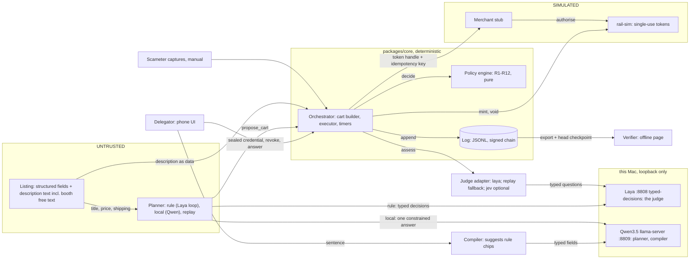
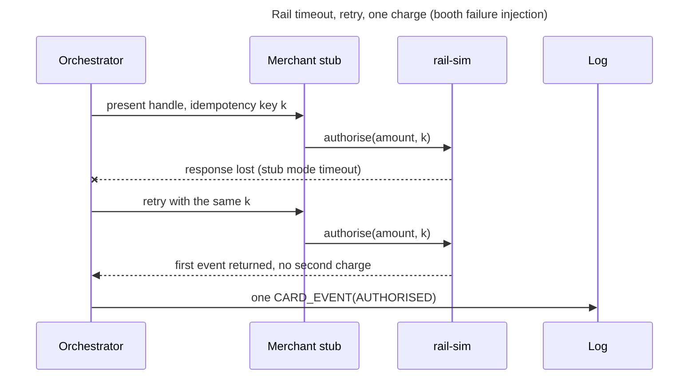
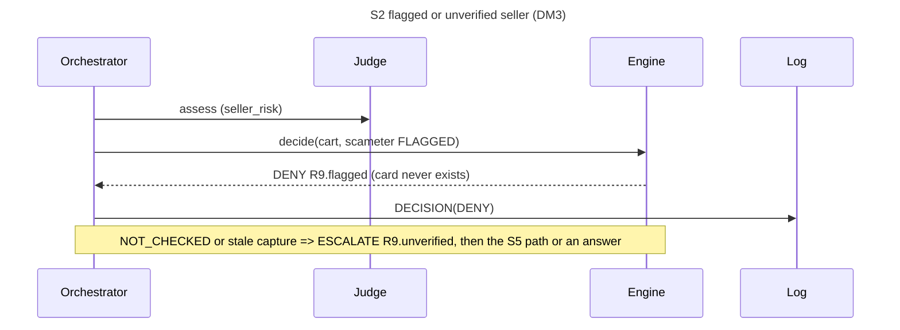
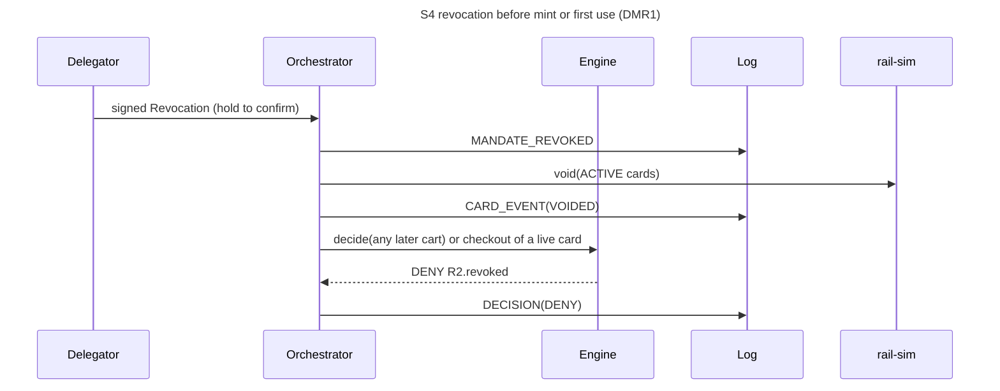
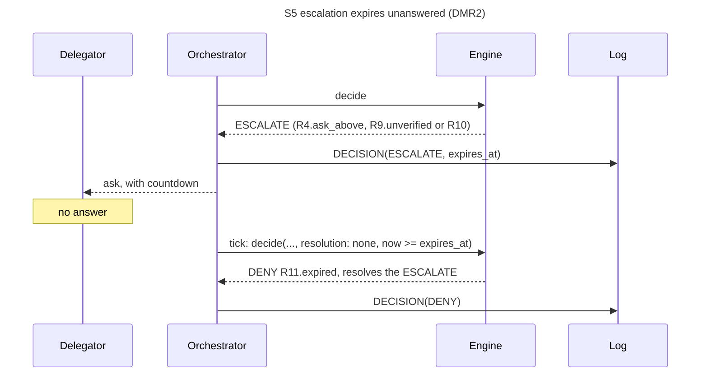
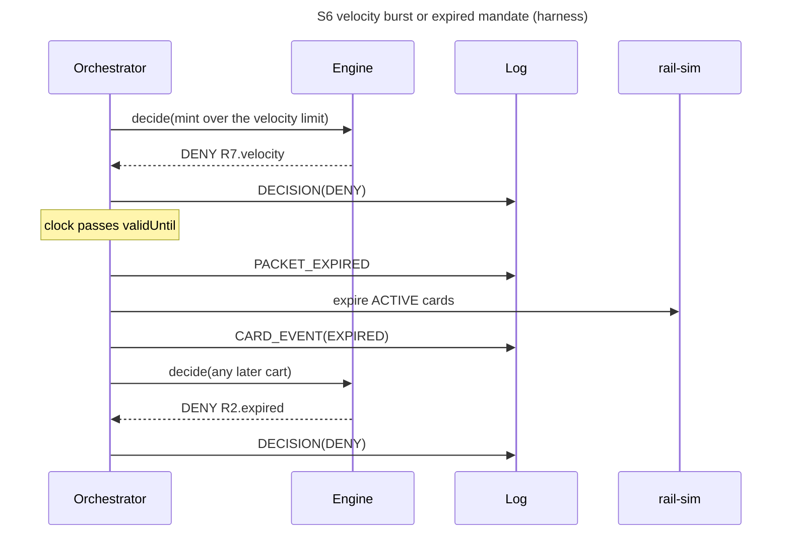

# 02 Architecture

- **Rail is SIMULATED** throughout.

## 1. Context



## 2. Sequences

```mermaid
sequenceDiagram
  title Happy path with blocked replay (DM1-DM2)
  participant D as Delegator
  participant O as Orchestrator
  participant P as Planner
  participant J as Judge
  participant E as Engine
  participant L as Log
  participant R as rail-sim
  participant M as Merchant stub
  D->>O: AgentDelegationCredential (seal)
  O->>E: verify proof against the pinned delegator (R1)
  O->>L: MANDATE_SEALED (seq 0, payload = credential)
  O->>P: intent + listing records
  P->>P: rule: Laya decision loop (logged); local: one Qwen answer, checked in code
  P-->>O: propose_cart
  O->>O: cart builder prices from the listing record
  par judge
    O->>J: assess(cart, listing, scameter)
  and fold
    O->>L: read the log, fold the packet
  end
  O->>E: decide(mandate, packet, cart, judge, now)
  E-->>O: APPROVE
  O->>L: DECISION (holds the limit)
  O->>O: re-fold: packet ACTIVE, approval unresolved, no card yet
  O->>R: mint(limit = total, ttl, merchantLock = cart domain, purpose)
  O->>L: CARD_MINTED
  O->>M: executor re-quotes (R12), presents handle + key
  M->>R: authorise(amount, key)
  O->>L: CARD_EVENT(AUTHORISED), the rail's own event
  M->>R: authorise again (replay, new key)
  R-->>O: DECLINED CARD_USED
  O->>L: CARD_EVENT(DECLINED)
  O-->>D: packet meter: remaining
```

```mermaid
sequenceDiagram
  title S1 over budget incl. shipping/FX (DM4; overshoot beat in DM2)
  participant O as Orchestrator
  participant E as Engine
  participant L as Log
  participant R as rail-sim
  participant M as Merchant stub
  O->>E: decide(total incl. shipping > remaining)
  E-->>O: DENY R3.over_remaining (no card)
  O->>L: DECISION(DENY)
  Note over O,M: after a mint, checkout re-quote differs
  O->>E: decideCheckout(approved decision, re-quote)
  E-->>O: DENY R12.price_drift
  O->>L: DECISION(DENY, resolves the APPROVE)
  O->>R: void(card)
  O->>L: CARD_EVENT(VOIDED)
  Note over M,R: merchant overshoot mode charges above the limit
  M->>R: authorise(amount > limit)
  R-->>O: DECLINED OVER_LIMIT (limit held)
  O->>L: CARD_EVENT(DECLINED)
```






```mermaid
sequenceDiagram
  title Escalation answered (R4 ask_above, R9 unverified, R10)
  participant D as Delegator
  participant O as Orchestrator
  participant E as Engine
  participant L as Log
  participant R as rail-sim
  O->>L: DECISION(ESCALATE, expires_at)
  O-->>D: ask, with countdown
  D->>O: signed answer (decision, mandate, cart_sha256, choice)
  O->>O: verify against the pinned delegator; read the ESCALATE from the log
  O->>E: decide(..., resolution{resolves, answer, escalated}, answerSignatureValid)
  E-->>O: APPROVE, or DENY R11 with answer_problem
  O->>L: DECISION(resolves)
  O->>R: mint, on APPROVE
```







## 3. Components

| Component | Package | Responsibility |
|---|---|---|
| **Orchestrator, cart builder, executor** | core | One per packet, one queue, timers; cart priced from the listing record only, HKD [F3]; checkout re-quote (R12) |
| **Engine, crypto, log** | core | Pure `decide`, `decideCheckout`; `foldPacket`; JCS, Ed25519, did:key, `verifyChain` |
| **Planners, compiler, judge adapters** | agent | `rule`, `local`, `replay`; sentence to rules; `SystemOneJudge` (laya, jev), replay judge |
| **Laya, Qwen** | services | Judge on :8808 [F11c]; planner and compiler on :8809 [F27, F63]; both 127.0.0.1 |
| **rail-sim, web, mobile, verifier, harness** | rail-sim, apps | `RailPort` + merchant stub; React PWA, Hono booth server [F64]; Capacitor shells; offline verifier [F66]; seeded replays ([05](05-evidence-plan.md)) |

## 4. Trust boundaries

| Component | Can | Cannot |
|---|---|---|
| **Planner** | read structured fields, the request; output `propose_cart` | read descriptions, keys, PAN/CVV, log; set money |
| **Judge** | return option probabilities | browse, plan, write; loosen a decision (I3) |
| **Engine** | return a Decision | do I/O, read a clock, mint |
| **Orchestrator** | sign entries (engine key), call the rail | mint without a logged APPROVE (I1); sign for the delegator |
| **rail-sim** | mint, void, authorise under F1 rules | exceed ceiling or max active [F1]; emit PAN/CVV |
| **Delegator** | seal, revoke, answer | override hard rules |
| **Verifier** | check entries, keys, checkpoint | trust the operator; go online |

## 5. Invariants

| ID | Enforcement point | Test |
|---|---|---|
| I1 | Mint only after a logged APPROVE and a fresh re-fold; a repeat returns the same card | T-I1 |
| I2 | `approved_limit_minor = cart.total_minor`; rail-sim mints exactly that | T-I2 |
| I3 | Judge enters only via R10; outcome = max severity | T-I3 |
| I4 | No keys in the planner; one `propose_cart` out; lint bans `agent` importing signing or rail-sim; model hosts loopback unless `*_ALLOW_REMOTE` | T-I4 |
| I5 | Timeouts [F33, F34]; judge TIMEOUT or ERROR → `R10.unavailable`; other errors → `{ ok: false }`, no card | T-I5 |
| I6 | R2; revoke voids ACTIVE cards; queue orders revoke against mint; mint re-folds the packet | T-I6 |
| I7 | `appendEntry` before side effects; one DECISION per decide; a stored log is verified before each fold | T-I7, T-V1 |
| I8 | No PAN/CVV/expiry fields; `appendEntry` refuses card-like text and keys (best effort); CI scans fixtures and prompts | T-I8 |

## 6. Data model

- **AP2 analogues** [F12]: MandateCredential = Intent mandate; Cart = Cart mandate; Decision and CardRecord = payment evidence. PacketState is folded from the log, never stored.
- **Packet accounting**: an APPROVE holds its limit in `committed_minor` until its card is logged, a later decision resolves it, or the packet ends; `VOIDED`/`EXPIRED` release a card, `AUTHORISED` moves the charge to spent; an over-committed log throws `PacketFoldError`.
- **Resolution**: an answer, R11 expiry or R12 drift makes a new Decision with `resolves`; an answer must bind to the escalated cart, the pinned delegator and a verified signature, else DENY R11.
- **Idempotency**: a decision id digests cart id, fingerprint, time and outcome; mint is keyed by `decision.id`, `authorise` by the executor's key. `submit` returns the earlier decision (`duplicate: true`) for a cart matching a live APPROVE or an open ESCALATE; `allowRepeat` decides afresh (booth buttons only).
- **Family budget** (D17): a credential may carry `parent`; `seal(credential, { parentCredential })` verifies it against the pinned parent key and `checkChildWithinParent` allows only narrowing, else `EXCEEDS_PARENT` and nothing logged. The parent is not in the child's log, so the offline verifier cannot check the link.

## 7. Rule catalogue

- **R1-R12**: pass conditions and failure outcomes are in [00](00-context.md) (Rules, Stops, template IDs). Failure-only templates: `R1.invalid_signature`, `R5.over_ceiling`, `R6.off_mandate`, `R8.max_active`, `R10.escalate`, `R10.unavailable`.
- **Details**: R1 also checks that packet and cart match the mandate (budget, currency, expiry, agent). R4 passes when the total is <= the cap and <= `ask_above`. R5 and R8 read the rail limits [F1], R7 the velocity window [F32], R9 a fresh capture if required [F52]. R12 compares every price field at the re-quote (`decideCheckout`) and voids the card. R10 reads the thresholds in §9.
- **Hard rules** R1-R8, R12 survive any answer; only R4 `ask_above`, R9 unverified and R10 ESCALATE are answerable. Outcome: any DENY, else any ESCALATE, else APPROVE; a FAIL without a verdict is DENY.

## 8. Explanation templates

- Ids `<rule>.<variant>`: [00-context](00-context.md). `render(templateId, inputs, locale)` is pure (no I/O, clock or LLM).

## 9. Judge adapter

```text
question             options                              effect (thresholds F36, F50)
scope_fit            in_scope | out_of_scope              P(in_scope) < T_scope                 -> ESCALATE R10.scope
injection_risk       clean | suspicious | injection       P(suspicious) + P(injection) >= T_inj  -> DENY R10.injection
seller_risk          low_risk | high_risk                 P(high_risk) >= T_sell_deny -> DENY; >= T_sell_esc -> ESCALATE   R10.seller_risk
escalate_or_proceed  proceed | escalate                   P(escalate) >= T_esc                  -> ESCALATE R10.escalate
```

- **Gate**: built in code from the first three questions; `escalate_or_proceed` carries no signal [F50]. Held-out (SIMULATED): 35/47 legitimate carts approved, 2/14 injected; the seller gate is inert. Judge level misses the F38 floor; the harness meets it end to end [F36, F69].
- **Providers**: `SystemOneJudge` for `laya` (default [F11c]) and `jev` (optional [F11b]); `replay` for CI and the booth fallback. No LLM judge.
- **Request**: `model: typed-decisions`, wording v5, rotations averaged back [F26]. Listing text sits only in `listing.description`, NFKC-normalised, never in instructions.
- **Failure**: `assess` never throws; timeout F34, no retry; TIMEOUT, ERROR or `usage.truncated` (Laya drops a long state's tail [F26]) → ESCALATE `R10.unavailable`. Windowing off [F55]; limits [F54].
- **Language gate**: a listing with at least 10% CJK letters (Han, kana, Hangul, Bopomofo, after NFKC) is not sent to the English-derived checkpoint [F26, F104]. The adapter returns ERROR, no answers and version `skipped:unsupported_language`; R10 escalates `R10.unavailable` with reason `unsupported_language` in its recorded inputs, and the template says the checker reads English best. `fit`, `tune` and `record` run with the gate off; `replay` is not gated.
- **Mode**: `JUDGE_MODE` (default `enforce`); `shadow` marks R10 SKIPPED.

```text
POST {LAYA_BASE_URL | JEV_BASE_URL}/v1/systemone          exact shape: services/laya/FINDINGS.md
{ model: "typed-decisions",
  state: { mandate: <intent text>, rules: "categories: ...", cart: "<qty> x <title> at HKD <price>", scameter: "<state>",
           listing: { title, description, part? } },          // description = untrusted listing text, a JSON string
  questions: { "<name>__r<k>": { type: "choice", instructions, option_order, criteria: { "<label>": "<description>" } }, ... } }
-> answers.<name>.{ choice, probabilities: { "<label>": p }, answer_confidence, confidence }
   usage.{ input_tokens, state_tokens, state_tokens_dropped, truncated, truncated_questions }
```

## 10. Rail simulator (SIMULATED)

| F1 semantic | rail-sim behaviour |
|---|---|
| Ceiling HK$2,000, max 2 active, validity <= 2 months [F1] | Token = `handle` + random `last4`, no PAN, CVV or expiry (I8); limit = approved total (I2); over ceiling → `OVER_CEILING`; third active → `MAX_ACTIVE`; TTL = min(F30, mandate expiry, F1 validity), else `TTL_TOO_LONG` |
| Credentials end after one payment [F1] | First AUTHORISED → USED; a replay declines `CARD_USED` (DM2) |
| Processed payment cannot be cancelled [F2] | `void` acts on ACTIVE tokens only |
| No merchant lock or purpose found [F1] | SIMULATED `merchant_lock`, default the approved cart's domain; another merchant → `MERCHANT_MISMATCH`; asked in 09 |

- **Idempotent**: `mint` by `decision.id`; `authorise` by key (a retry returns the first event); the executor logs the rail's own record, not the merchant's claim.
- **Refusals** are typed (§18): the executor refuses unless decision and card are in the log, with at most 3 merchant calls per checkout [F53]. Stub mode `preauth` charges above the quote [F2]: a false block, tolerance asked in 09.
- **Calibration (T-R1)**: one real decline [F40] is pending (05); until then sim-only.

## 11. Crypto

- **Libraries**: `@noble/*`, `@scure/base`, `canonicalize` (RFC 8785); tested on the W3C vc-di-eddsa, RFC 8785 and RFC 8032 vectors.
- **Keys**: did:key = `did:key:z` + base58btc(0xed 0x01 + public key) for delegator, agent, engine; no rotation, so a leaked key means a new mandate. Demo keys: `pnpm keys:gen` (gitignored `.keys/`).
- **Credential**: AgentDelegationCredential (VC 2.0, ADR-0007). R1 = `verifyMandateCredential(vc, { expectedIssuer })`; no pinned delegator, no pass.
- **Other signatures**: Ed25519 over UTF-8(`<domain>:` + hex SHA-256(JCS(object minus `signature`))); domains `laisee.revoke.v1`, `laisee.resolve.v2` (delegator; answers carry `mandate_id`, `cart_sha256`), `laisee.log.v1` (engine). The head `{log_id, seq, entry_hash}` is published outside the log.
- **Shortcut**: the web API holds the delegator demo key; on-device mode makes every key in the page (`apps/web/src/api/local/KEYS.md`).
- **The log proves** tamper, reorder, truncation (with the checkpoint), signatures and, for what is logged, consent and money; not omissions or intent.

```text
AgentDelegationCredential { @context: [credentials/v2, laisee delegation/v1], type: [VerifiableCredential, AgentDelegationCredential],
  id: urn:laisee:mandate:mnd_..., issuer: <delegator did:key>, validFrom, validUntil,
  credentialSubject: { id: <agent did:key>, intent_text, rules, parent? }, proof: DataIntegrityProof }

signMandateCredential(vc, delegatorKey)                          Data Integrity, eddsa-jcs-2022
 unsecured   = vc without proof
 proofConfig = {@context: vc.@context, type: DataIntegrityProof, cryptosuite: eddsa-jcs-2022, created,
                verificationMethod: <issuer did>#<fragment>, proofPurpose: assertionMethod}
 hashData    = SHA-256(JCS(proofConfig)) || SHA-256(JCS(unsecured))           config hash first
 proofValue  = "z" + base58btc(Ed25519.sign(hashData))
verifyMandateCredential(vc, {expectedIssuer}): issuer == pinned delegator, proof @context == document @context, rebuild hashData,
  Ed25519.verify; any mismatch => R1 DENY (reasons SCHEMA, ISSUER_UNPINNED, WRONG_ISSUER, ISSUER_KEY, VERIFICATION_METHOD, PROOF_VALUE, SIGNATURE)

verifyChain(entries, publicKeys, headCheckpoint?)  -> ok + head | first failing seq + reason, per entry in this order
 0 publicKeys: a delegator did:key is pinned and is not also an engine key                KEYS
 1 parse each line; validate against log-entry.schema.json                              SCHEMA
 2 seq == line index                                                                    SEQ
 3 prev_hash == entry_hash of seq-1 (seq 0: 64 x "0")                                   PREV_HASH
 4 payload_hash == hex(SHA256(JCS(payload)))                                            PAYLOAD_HASH
 5 entry_hash == hex(SHA256(JCS({v,log_id,seq,kind,ts,prev_hash,payload_hash,signer})))   ENTRY_HASH
 6 signer in publicKeys.engine and Ed25519.verify(signature, "laisee.log.v1:" + entry_hash) SIGNATURE
 7 seq 0 credential vs the pinned delegator, log id derived from its mandate; revocations and answers signed by the delegator,
   answers bound to the mandate and to an earlier ESCALATE                              PAYLOAD_SIGNATURE
 8 if headCheckpoint: entry at checkpoint.seq exists with the same entry_hash           TRUNCATED
 9 consent and money against the signed terms, what is logged only: a card follows one APPROVE at its limit (NO_DECISION, DUPLICATE);
   ask_above and escalations rest on an in-time APPROVE answer for the same cart (CONSENT); caps, card limits, budget hold (OVERSPEND);
   nothing approved or minted outside validity or after a revoke or expiry (AFTER_REVOKE)
 not checked: re-fold of PacketState, re-rendered explanations, rule results, entries never logged
```

## 12. Threat model

| Threat | Mitigation | Residual risk |
|---|---|---|
| **Prompt injection** | Planner reads no descriptions (`includeListingText` is off), holds no keys (I4); R10 | Judge misses [F36]; shown text moved Qwen in 2/31 cases [F68]; image text unchecked |
| **Price change** | Limit = total (I2); re-quote → R12 + void; short TTL [F30] | Pre-auth → false block [F2] |
| **Double mint or charge** | Mint keyed by `decision.id`; idempotent `authorise` and `submit`; R8; verifier refuses a second card per APPROVE | `allowRepeat` opts out on purpose (booth scenario buttons); bounded by R3, R7, R8 |
| **Revocation race** | Per-packet queue; revoke voids ACTIVE tokens; later carts, checkouts DENY R2 | A used card is final [F2] |
| **Log tampering, replay** | Hash chain; signatures bind `log_id`, `seq`, mandate, cart; checkpoint; verifier step 9 | Engine-key holder rewrites after the last checkpoint; unlogged events unseen |
| **Key custody** | Delegator pinned in orchestrator and verifier; roles separate | Demo shortcut (§11), Mum's key too; no rotation |
| **LAN mode** | Pairing token, Host and Origin allowlists (§15) | Plain http, one shared token: its holder can run scenarios, tamper and reset |
| **Card data in logs** | No PAN/CVV fields; `appendEntry` guard; size caps [F67] | Best effort; the SIMULATED handle is in `CARD_MINTED` by design |
| **Judge false allow, outage; Scameter miss** | Judge only tightens (I3); hard rules hold; ERROR or truncation → ESCALATE; "no record" is not "safe" [F6, F52] | Clean-looking scam listing; new scam shops |

## 13. Stack and repo layout

```text
apps/web            Vite + React PWA (incl. Booth), Hono booth server (HTTP + SSE), portable booth backend
apps/verifier       static offline verifier page (one file, strict CSP)
apps/mobile         Capacitor 8 shells for iOS and Android around the on-device web build
packages/core       types from schemas, packet fold, R1-R12, engine, explain, crypto + credential, log, verifier, cart, executor, orchestrator, ports
packages/rail-sim   RailPort + merchant stub (SIMULATED)
packages/agent      planners (rule, local, replay), compiler, judge adapters (SystemOneJudge, replay), shadow wrapper, judge fit
packages/harness    seeded replay scenarios, B0/B1/B2 metrics
services/laya       local Laya server: setup.sh, serve.sh, stop.sh, smoke.mjs (Python venv and weights gitignored)
services/qwen       local llama-server for Qwen3.5: setup.sh, serve.sh, stop.sh, smoke.mjs (weights gitignored)
scripts/            keys-gen, verify-log, demo-reset, booth-check, gen-types, docs-check, trace-check, pages-build
schemas/            JSON Schema 2020-12, source of truth
data/               fixtures (SIMULATED), captures (OBSERVED), results (MEASURED), public-keys.json
docs/
```

- **JSON Schema first**: generated types; ajv validators compiled ahead of time (no `eval`, strict CSP on the verifier); `gen-types --check` guards stale output.
- **Append-only JSONL**, no database; a restart on an existing log is refused (`LOG_EXISTS`); `pnpm demo:reset` starts clean. Models run over loopback HTTP outside the TypeScript packages (ADR-0006, ADR-0008, ADR-0009).
- **Modes**: `http` (Mac with Laya and Qwen; the page probes `/api/info` for 1.5 s [F65], else falls back); `local` on-device (real stack and signers in the page, recorded answers, so typed text escalates). LAN mode adds a pairing token (§15).

## 14. Planner

- **Providers** (`PLANNER_PROVIDER`): `rule`, `local`, `replay`; the booth server defaults to `auto`: `local` if Qwen's `/health` answers in 1.5 s [F64], else `rule` if Laya's does, else `replay`, chosen once at start. All return no proposal on failure (I5), read structured fields only, set no money (I4).
- **`rule`**: the Laya decision loop in a deterministic harness, not a generative LLM: typed choices (item, variant, next action) logged with probabilities; small margins abstain [F47]; step cap [F46].
- **`local`**: Qwen3.5-9B reads English, Chinese or Cantonese and returns one grammar-constrained JSON answer; enums come from the supplied catalogue; code clamps quantity and guards near-ties [F58]. On 25 calls: wrong item in 0/26 scenarios; author-written cases, no held-out set [F68]. Qwen never gates a decision (ADR-0009).
- **Compiler**: the model fills typed fields, code computes money and dates, the shopper confirms; failure falls back to the rule-based compile [F60].
- **Photo reader** (`POST /api/see`, not a run, buys nothing): the same Qwen server reads a picture, a screenshot or words and returns typed fields (kind, colours, pattern, fit, style) from fixed lists. The phone shrinks and re-encodes the picture and works out the colour plates; code matches a SIMULATED shop and fixes a pick's proposal, then the judge and rules R1-R12 run as for any ask. It names the kind of garment in 25 of 29 retailer photos [F68a]; it does not understand photos. The on-device build has no model: the shopper taps the kind on chips. Settings: F63a.

## 15. Env config

```text
JUDGE_PROVIDER=laya|jev|replay     JUDGE_MODE=enforce|shadow (default enforce)
LAYA_BASE_URL=http://127.0.0.1:8808    LAYA_MODEL=typed-decisions    LAYA_ALLOW_REMOTE=1 (listing text then leaves the Mac)    LAYA_API_KEY=
PLANNER_PROVIDER=auto|rule|local|replay (default auto, see §14; CI and booth fallback: replay)
PLANNER_BASE_URL=http://127.0.0.1:8809    PLANNER_MODEL=qwen3.5-9b-q4km    PLANNER_ALLOW_REMOTE=1 (the request then leaves the Mac)
QWEN_MODEL=9b|4b (serve)   QWEN_MODELS="9b 4b" (setup: which weights to fetch)   QWEN_SKIP_VERIFY=1 (skip the SHA-256 check)   QWEN_SPEC=mtp|off
JEV_BASE_URL=  JEV_MODEL=jev-1.13.0 [F11b]  TYPESAFE_API_KEY=      optional: hosted jev
RAIL_MODE=sim    KEY_DIR=./.keys    LOG_DIR=./.data/logs    PORT=8787    VITE_API=local (on-device build)
HOST=127.0.0.1 (default). Any non-loopback HOST, or the --lan flag, turns LAN mode on
WALLY_SESSIONS=on|off (default: on with LAN mode, off without)    WALLY_PUBLIC_URL=https://... (practice copy: a second QR under the pairing one, on the Mac only)
```

```text
pnpm demo                preflight, build if needed, start API and UI on 127.0.0.1:8787
pnpm demo:reset          new demo keys, empty logs, back to the sealed packet
pnpm demo:lan            booth-check --lan, then the server with --lan: binds 0.0.0.0, LAN mode ON, pairing links and a QR code in About and Presenter
pnpm keys:gen            pnpm verify-log <log> <public-keys> [checkpoint]      pnpm verifier (one-file offline page)      pnpm coverage
pnpm harness -- --seed 7 --n 150 --judge live|recorded [--record --provisional <reason>]
pnpm --filter @wally/agent judge:fit        node scripts/gen-types.mjs --check (also checks the precompiled validators)
services/{laya,qwen}/{setup,serve,stop}.sh
GET  /api/health /info /snapshot /log /export /events (SSE) /family /lan
POST /api/seal /scenario/:id /propose /ask /alternatives /see /compile /revoke /escalation/answer /verify /tamper /restore /reset      (loopback Host and Origin only; LAN mode: the guards below)
```

- **No variable is required**; no key. Secrets in `.env` only (gitignored).
- **LAN mode** (off by default): `/api/*` needs the pairing token [F92] (header `X-Wally-Token` or cookie `wally_t`) except `/api/health` and `/api/lan`; a page on the Mac needs none and alone reads `/api/lan` (token, links, QR). Host must be loopback or the Mac's own address or name; a POST Origin must be the page's own, loopback or a native shell.
- **Practice wallets** (`WALLY_SESSIONS`, on with LAN mode): a client past the pairing token gets its own wallet on its first `/api/*` call, named by cookie `wally_s` (HttpOnly, SameSite=Strict) or header `X-Wally-Session` (native shells keep no cookie). The Mac (loopback Host and peer) keeps the shared booth wallet. A wallet has its own demo keys, in-memory log, orchestrator and event stream, with the preset budget sealed at once; Laya and Qwen are shared and runs take turns at them, 2 at a time [F109]: with 12 phones the judge answered in 381 ms at p95, against 1,352 ms without turns [F112]; a wallet takes 9 ms to make [F111]. At most 12 wallets [F108]: one with a page open, or used in the last 5 s, is never dropped for room, the least recently used of the rest goes, and with none to drop the next visitor gets a 503 and runs on the device; 45 idle minutes [F108]; 200 log entries at most [F110], since each request reads the whole log [F113]. `/api/info` says `sessions: "shared" | "private"`; reset, tamper, cancel and the exported log are per wallet; `/api/health`, `/api/lan` and the app files are global.

## 16. Latency budget

- **Planner** 20 s [F33], local 9B p95 2,593 ms [F68]. **Judge** 1,500 ms per call [F34], p95 345 ms [F26]; a loaded host can time it out [F69]. **Cart proposed → verdict + mint** p95 <= 3,000 ms [F35]; B2 live p95 388.9 ms [F69].

## 17. Real vs simulated

| Part | Status |
|---|---|
| Card rail, merchant, amounts | SIMULATED; no issuing API found [F1]; [F20-F23] |
| Credential, signing, chain, verifier | REAL crypto, throwaway keys; demo shortcut (§11) |
| Judge, planner | REAL local models [F11c, F27]; `replay` and on-device recordings labelled |
| Scameter | manual REAL captures + SIMULATED flagged fixture [F6] |
| Decline test, shop probe, listings | REAL human-run captures, still pending [F39, F40]; fixtures SIMULATED |

## 18. Interfaces

- **Ports** in `packages/core/src/ports.ts`, types generated from `schemas/`; `core` never imports `agent`. Failures return `{ ok: false, code }` and fail closed.

```ts
import type { Mandate, MandateCredential, Cart, Decision, LogEntry, CardRecord, PacketState, ListingRecord } from "./generated";
type JudgeRecord = Decision["judge"];
type EscalationAnswer = NonNullable<NonNullable<Decision["escalation"]>["answer"]>;
type CardEvent = Extract<LogEntry, { kind: "CARD_EVENT" }>["payload"];
type TemplateId = NonNullable<Decision["explanation"]>["template_id"];
type Checkpoint = { log_id: string; seq: number; entry_hash: string };

interface Clock { now(): Date }
interface Signer { did: string; sign(message: Uint8Array): Uint8Array }

interface ProposeCartInput { listing_url: string; items: { title: string; variant?: string; qty: number }[]; note?: string } // no money fields
// listing text is untrusted data: backends keep it in a delimited block or ignore it (the booth default ignores it)
interface PlannerContext { intentText: string; listings: { url: string; text: string }[] }
interface PlannerStop { templateId: TemplateId; remainingMinor: number }                  // R3 or R4 stops only
interface PlannerTraceStep { step: number; question: string; choice: string; probabilities: Record<string, number>; margin: number; source?: "typed" | "generative"; latencyMs?: number }
interface PlannerOptions { timeoutMs: number; onTrace?: (step: PlannerTraceStep) => void }
type PlannerProvider = "rule" | "replay" | "local" | "claude";                               // the factory refuses "claude"
interface PlannerPort {
  propose(ctx: PlannerContext, opts: PlannerOptions): Promise<ProposeCartInput | null>;     // null = no proposal; never throws
  alternatives?(ctx: PlannerContext, stop: PlannerStop, opts: PlannerOptions): Promise<ProposeCartInput | null>;
}
type PlannerFactory = (listings: ListingRecord[]) => PlannerPort;                           // the orchestrator builds one per submit

interface JudgeInput { intentText: string; rules: Mandate["rules"]; cart: Cart; listingText: string; scameter: Cart["scameter"] }
interface JudgePort {
  readonly provider: "laya" | "jev" | "replay";
  assess(input: JudgeInput, opts: { timeoutMs: number; signal?: AbortSignal }): Promise<JudgeRecord>; // never throws
}

type MintErrorCode = "NOT_APPROVED" | "ALREADY_MINTED" | "OVER_CEILING" | "MAX_ACTIVE" | "TTL_TOO_LONG"; // NOT_APPROVED also for an APPROVE carrying a FAIL
type DeclineCode = "OVER_LIMIT" | "CARD_USED" | "CARD_VOIDED" | "CARD_EXPIRED" | "UNKNOWN_HANDLE" | "MERCHANT_MISMATCH";
type StubMode = "honest" | "overshoot" | "drift" | "preauth" | "timeout" | "wrong_merchant"; // merchant stub (SIMULATED)
// executor refuses before any merchant call unless decision and card are in the log as given:
type ExecutorRefusal = "MANDATE_REVOKED" | "PACKET_EXPIRED" | "APPROVAL_NOT_LOGGED" | "APPROVAL_RESOLVED" | "CARD_NOT_LOGGED" | "LOG_INVALID" | "RAIL_MISMATCH";
interface RailPort {
  // limit = decision.approved_limit_minor; idempotent by decision.id (a repeat returns the same CardRecord); throws MintError
  mint(req: { decision: Decision; ttlMs: number; now: Date; merchantLock?: string; purpose?: string }): Promise<CardRecord>;
  // idempotent by idempotencyKey: a retry returns the first event, never a second charge
  authorise(req: { handle: string; amountMinor: number; merchantDomain: string; idempotencyKey: string; now: Date }): Promise<CardEvent>;
  void(cardId: string, now: Date): Promise<CardEvent>;
  expireDue(now: Date): Promise<CardEvent[]>;
  eventFor?(idempotencyKey: string): Promise<CardEvent | null>;     // the rail's own record for a key; the executor logs this
}
interface MerchantPort {
  quote(input: { cart: Cart; now: Date }): Promise<MerchantQuote>;                           // checkout re-quote (R12)
  checkout(input: { cart: Cart; handle: string; idempotencyKey: string; now: Date }): Promise<CardEvent>;
}

interface LogStore {
  read(logId: string): Promise<LogEntry[]>;
  head(logId: string): Promise<Checkpoint | null>;
  append(entry: LogEntry): Promise<void>; // append-only; rejects seq !== head.seq + 1
}

declare function appendEntry(store: LogStore, signer: Signer, logId: string, kind: LogEntry["kind"], payload: LogEntry["payload"], now: Date): Promise<LogEntry>;
declare function signMandateCredential(unsigned: Omit<MandateCredential, "proof">, signer: Signer, opts: { created: Date }): MandateCredential;
declare function verifyMandateCredential(input: unknown, opts: { expectedIssuer: string }): { valid: true } | { valid: false; reason: string; detail: string };
declare function mandateFromCredential(vc: MandateCredential): Mandate;

interface EscalationResolution { resolves: string; answer?: EscalationAnswer; escalated?: Decision } // escalated = the OPEN ESCALATE read from the log; absent => DENY R11
interface DecideContext { mandateProofValid?: boolean; answerSignatureValid?: boolean }            // absent or not true => fail closed
interface EngineConfig { judge_mode: "enforce" | "shadow"; /* rail, card, escalation, velocity, seller, judge, timeouts, latency: one row each in the register */ }
declare const engine: {
  // pure and total over schema-valid input; the only producer of a Decision
  decide(mandate: Mandate, packet: PacketState, cart: Cart, judge: JudgeRecord, now: Date, resolution?: EscalationResolution, ctx?: DecideContext): Decision;
  // R12 at checkout: null when the approval stands, else a DENY that resolves it (the caller voids the card)
  decideCheckout(input: { mandate: Mandate; packet: PacketState; approved: Decision; quote: MerchantQuote; now: Date; ctx?: DecideContext }): Decision | null;
};
declare function foldPacket(entries: LogEntry[], now: Date): PacketState;                  // throws PacketFoldError on a log it cannot trust
declare function render(templateId: TemplateId, inputs: Record<string, unknown>, locale: "en" | "zh-HK"): string;

// One orchestrator per packet. deps: engine, planner (PlannerFactory), judge, rail, merchant, store, signer (engine key), clock,
// ids, scameter, appendEntry, delegatorDid (required, pinned), executor?, config?. Every method resolves; none rejects.
interface Orchestrator {
  seal(credential: unknown, options?: { parentCredential?: unknown }): Promise<SealResult>; // R1 first; LOG_EXISTS if the log has entries; a family budget needs the parent credential (EXCEEDS_PARENT if wider)
  submit(req: { requestText: string; listings: ListingRecord[]; checkout?: "auto" | "none"; allowRepeat?: boolean }): Promise<SubmitResult>; // a live repeat returns the earlier decision with duplicate: true
  suggestAlternatives(req: { decisionId: string }): Promise<SubmitResult>;   // after a DENY by R3 or R4; else NOT_APPLICABLE; result carries alternativeTo
  checkout(req: { cardId: string; idempotencyKey?: string }): Promise<CheckoutResult>;   // AUTHORISED | DECLINED | DRIFT | DENIED | TIMEOUT
  answerEscalation(signedAnswer: unknown): Promise<AnswerResult>;
  revoke(signedRevocation: unknown): Promise<RevokeResult>;
  tick(): Promise<TickResult>;                                          // R11 expiry, card expiry, PACKET_EXPIRED
  snapshot(): Promise<OrchestratorSnapshot>;
  subscribe(listener: (event: OrchestratorEvent) => void): () => void;
}

type VerifyFailure = "KEYS" | "SCHEMA" | "SEQ" | "PREV_HASH" | "PAYLOAD_HASH" | "ENTRY_HASH" | "SIGNATURE" | "PAYLOAD_SIGNATURE" | "TRUNCATED"
  | "NO_DECISION" | "DUPLICATE" | "CONSENT" | "OVERSPEND" | "AFTER_REVOKE";
type VerifyResult = { ok: true; head: Checkpoint } | { ok: false; failedSeq: number; reason: VerifyFailure };
declare function verifyChain(entries: LogEntry[], publicKeys: { engine: string[]; delegator: string }, headCheckpoint?: Checkpoint): VerifyResult;
```
