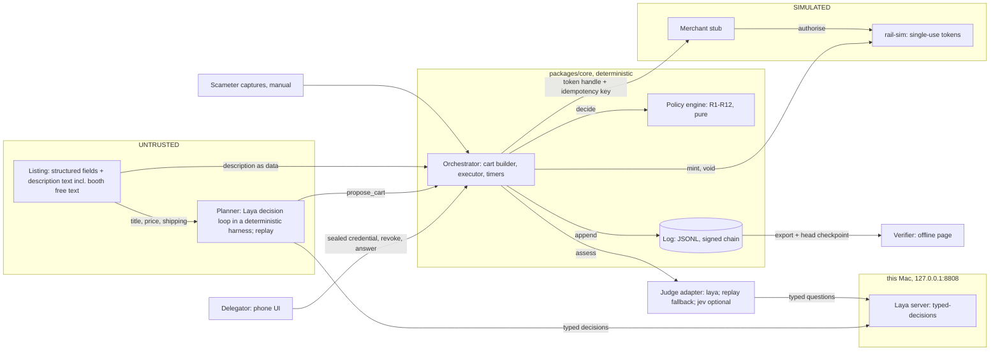
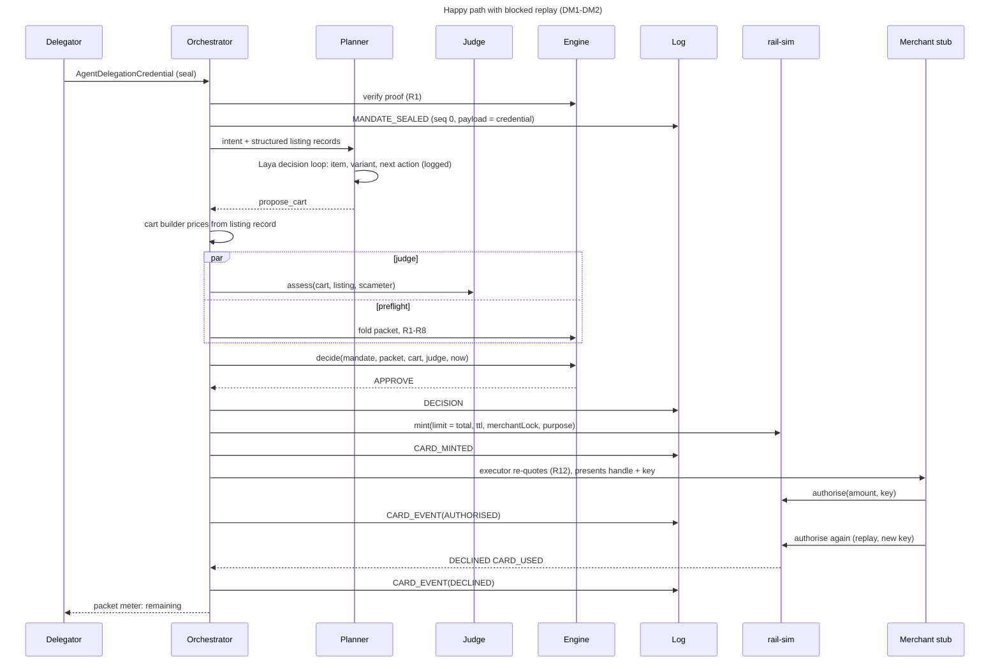
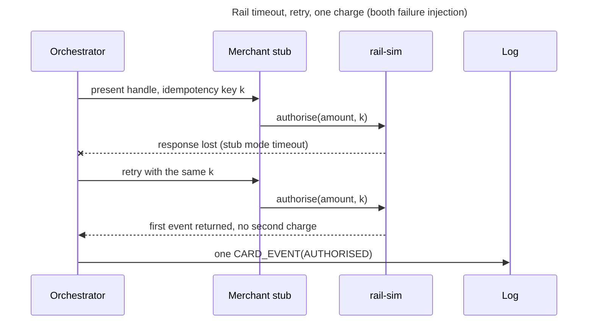
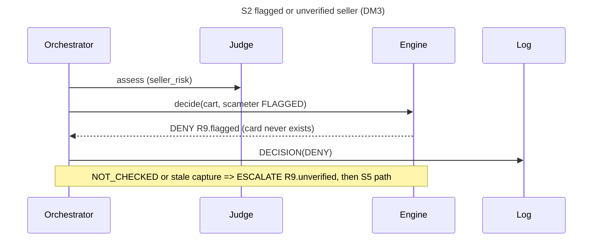
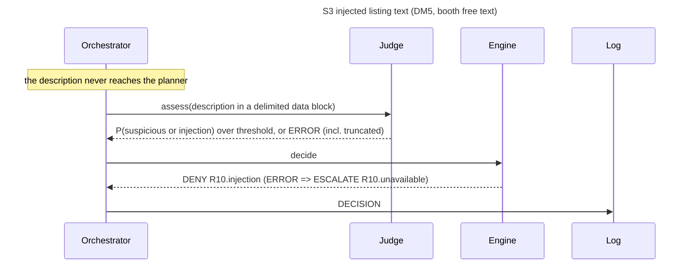
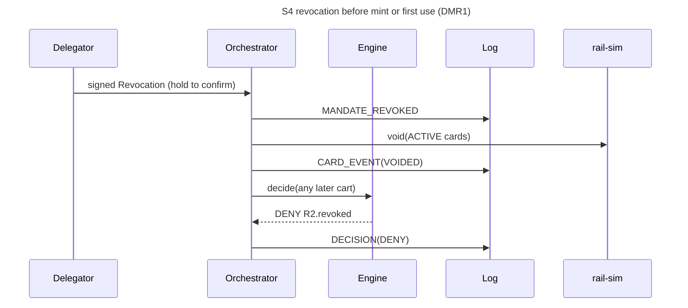
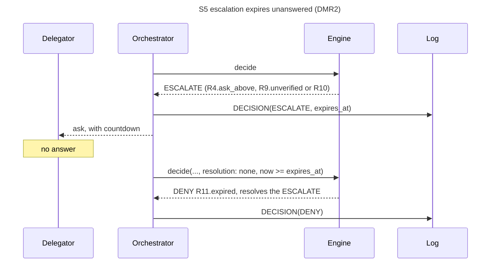
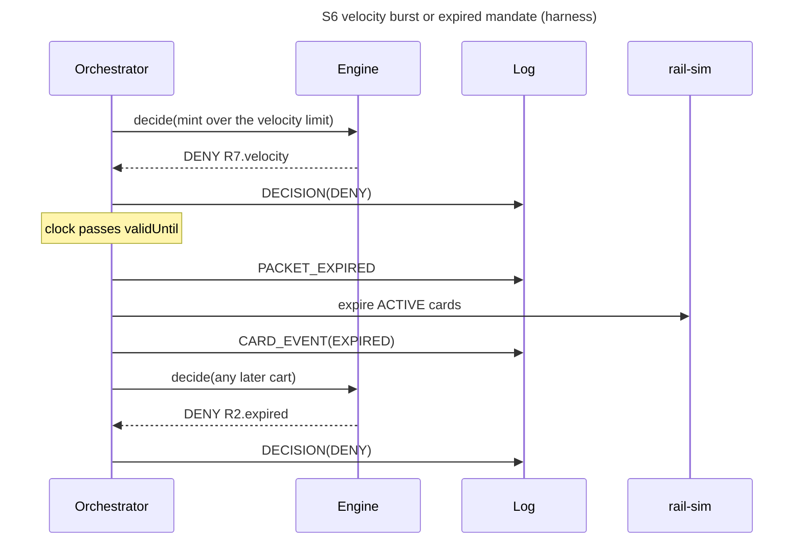

# 02 Architecture

- **Rail is SIMULATED** throughout. Not affiliated with HKT, Tap & Go or Mastercard.

## 1. Context



- **Single writer**: one orchestrator queue per packet.

## 2. Sequences



```mermaid
sequenceDiagram
  title S1 over budget incl. shipping/FX (DM4; overshoot beat in DM2)
  participant O as Orchestrator
  participant E as Engine
  participant L as Log
  participant R as rail-sim
  participant M as Merchant stub
  O->>E: decide(total incl. shipping > remaining)
  E-->>O: DENY R3.over_remaining (no card)
  O->>L: DECISION(DENY)
  Note over O,M: after a mint, checkout re-quote differs
  O->>E: decide(re-quoted cart, resolves APPROVE)
  E-->>O: DENY R12.price_drift
  O->>L: DECISION(DENY)
  O->>R: void(card)
  O->>L: CARD_EVENT(VOIDED)
  Note over M,R: merchant overshoot mode charges above the limit
  M->>R: authorise(amount > limit)
  R-->>O: DECLINED OVER_LIMIT (limit held)
  O->>L: CARD_EVENT(DECLINED)
```













## 3. Components

| Component | Package | Responsibility |
|---|---|---|
| **Orchestrator** | core | Pipeline, per-packet queue, timers (R11, TTL, expiry), booth scenarios, checkpoint |
| **Cart builder** | core | `propose_cart` → Cart priced from the listing record incl. shipping, fees, FX [F3] |
| **Executor** | core | Checkout: re-quote (R12), handle + idempotency key, CARD_EVENT |
| **Policy engine** | core | Pure `decide` over R1-R12; `foldPacket`; template renderers |
| **Crypto + log** | core | JCS, SHA-256, Ed25519, did:key, credential proof, `verifyChain` |
| **Planner** | agent | Laya decision loop (`rule`), `replay`, optional `claude` |
| **Judge adapters** | agent | `SystemOneJudge` (laya, jev), replay judge, shadow wrapper |
| **Laya server** | services/laya | The only model, 127.0.0.1:8808 [F11c] |
| **rail-sim** | rail-sim | `RailPort` + merchant stub, F1 semantics |
| **Web, verifier** | apps | React UI incl. Booth, thin Hono API, SSE trace; static offline verifier |
| **Harness** | harness | Seeded replays through the same ports ([05](05-evidence-plan.md)) |

## 4. Trust boundaries

| Component | Can | Cannot |
|---|---|---|
| **Planner** | read structured fields; ask Laya typed questions; output `propose_cart` | read descriptions, keys, handle, PAN/CVV or log; set money; decide |
| **Judge** | return option probabilities | browse, plan, write; loosen a decision (I3) |
| **Engine** | return a Decision | do I/O, read a clock, mint |
| **Orchestrator** | sign entries, call the rail | mint without a logged APPROVE (I1); edit a Decision |
| **rail-sim** | mint, void, authorise under F1 rules | exceed ceiling or max active [F1]; emit PAN/CVV |
| **Delegator** | seal, revoke, answer escalations | override hard rules by answering |
| **Verifier** | check entries, keys, checkpoint | trust the operator; go online |

## 5. Invariants

| ID | Enforcement point | Test |
|---|---|---|
| I1 | Mint only after an appended APPROVE; `mint` rejects non-APPROVE, a repeat returns the same card | T-I1 |
| I2 | `approved_limit_minor = cart.total_minor` only if R3 and R5 pass; rail-sim mints exactly that | T-I2 |
| I3 | Judge enters only via R10 (DENY/ESCALATE); outcome = max severity | T-I3 (property) |
| I4 | No keys in the planner (optional claude: `ANTHROPIC_API_KEY` only); output = one `propose_cart` input; lint bans `agent` importing signing or rail-sim | T-I4 |
| I5 | Typed port failures under timeouts [F33, F34]; judge TIMEOUT or ERROR → `R10.unavailable`; rail or engine error → no card | T-I5 (fault injection) |
| I6 | R2; revoke voids ACTIVE cards; queue orders revoke against mint | T-I6 |
| I7 | `appendEntry` before side effects; one DECISION per decide | T-I7, T-V1 |
| I8 | No PAN/CVV/expiry fields (`additionalProperties: false`); CI scans logs, fixtures, prompts for Luhn-valid runs and "cvv" | T-I8 |

## 6. Data model

- **Source of truth**: `schemas/` (draft 2020-12). Money = integer HKD cents; time = RFC 3339 UTC; hashes = hex SHA-256; log signatures = base64url; `proofValue` = base58btc.

| Schema | AP2 analogue [F12] | Producer | Logged as |
|---|---|---|---|
| MandateCredential | Intent mandate | delegator | `MANDATE_SEALED` payload |
| Mandate (domain view) | none | `mandateFromCredential` | never stored |
| Cart | Cart mandate | cart builder | inside `DECISION` |
| Decision, CardRecord | payment-mandate evidence | engine, rail-sim | `DECISION`, `CARD_MINTED` |
| LogEntry, PacketState | none | orchestrator, `foldPacket` | every line; never stored |

- **Packet accounting**: commit on `CARD_MINTED`; release on `VOIDED`/`EXPIRED`; `AUTHORISED` moves the actual amount to spent.
- **Resolution**: an answer, R11 expiry or R12 drift creates a new Decision with `resolves`.
- **Idempotency**: cart fingerprint = SHA-256(JCS(cart minus `id`, `proposed_at`)); mint keyed by `decision.id`; `authorise` by the executor's idempotency key.

## 7. Rule catalogue

| ID | Inputs | Pass when | On fail | Module `core/src/rules/` |
|---|---|---|---|---|
| R1 | credential, issuer did:key | proof verifies (eddsa-jcs-2022) | DENY `R1.invalid_signature` | `mandate.ts` |
| R2 | revocations, `validUntil`, now | not revoked, not expired | DENY `R2.revoked`, `R2.expired` | `mandate.ts` |
| R3 | total, remaining | total <= remaining | DENY `R3.over_remaining` | `money.ts` |
| R4 | total, `per_purchase`, remaining | total <= cap and <= `ask_above` | DENY `R4.over_cap`; ESCALATE `R4.ask_above` | `money.ts` |
| R5 | total, ceiling [F1] | total <= ceiling | DENY `R5.over_ceiling` | `money.ts` |
| R6 | domain, item categories | allowed, not denied, categories listed | DENY `R6.off_mandate` | `scope.ts` |
| R7 | `mint_times`, limit [F32] or override | mints in window < max | DENY `R7.velocity` | `rate.ts` |
| R8 | active cards, max [F1] | active < max | DENY `R8.max_active` | `rate.ts` |
| R9 | Scameter state, capture age [F52] | not FLAGGED; captured and fresh if required | DENY `R9.flagged`; ESCALATE `R9.unverified` | `seller.ts` |
| R10 | JudgeRecord, profile | under thresholds (§9) | DENY or ESCALATE | `judge.ts` |
| R11 | escalation, window [F31] | answered in time | DENY `R11.expired` | `escalation.ts` |
| R12 | approved cart, checkout re-quote | prices equal | DENY `R12.price_drift` + void | `drift.ts` |

- **Hard rules** R1-R8, R12 survive any answer; only R4 `ask_above`, R9 unverified, R10 ESCALATE are answerable. Outcome: any DENY, else any ESCALATE, else APPROVE.

## 8. Explanation templates

- **Format** `<rule>.<variant>`; `render(templateId, inputs, locale)` is pure: no I/O, clock or LLM.
- **Primary reason**: first FAIL in rule order whose verdict equals the outcome. A delegator DENY reuses the escalating rule's template.
- **IDs**: full list in [00-context](00-context.md) (Stops). Example: `R3.over_remaining` → "Stopped by R3. Total HK$550 is over the HK$541 left." [F22]

## 9. Judge adapter

| Question | Options | Metric | Threshold [F36, F50] | Effect |
|---|---|---|---|---|
| `scope_fit` | in_scope, out_of_scope | P(in_scope) | below `T_scope` | ESCALATE `R10.scope` |
| `injection_risk` | clean, suspicious, injection | P(suspicious) + P(injection) | at or above `T_inj` | DENY `R10.injection` |
| `seller_risk` | low_risk, high_risk | P(high_risk) | `T_sell_deny` DENY, `T_sell_esc` ESCALATE | `R10.seller_risk` |
| `escalate_or_proceed` | proceed, escalate | P(escalate) | at or above `T_esc` | ESCALATE `R10.escalate` |

- **Gate**: built in code from `scope_fit`, `injection_risk`, `seller_risk`; `escalate_or_proceed` stays in the contract, no signal in our run [F50].
- **Providers**: `SystemOneJudge` for `laya` (default, local [F11c]) and `jev` (hosted, optional [F11b]), one wire format; `replay` returns recorded JudgeRecords (CI, booth fallback). No LLM judge.
- **Request**: one call, `model: typed-decisions`, semantic labels only (no yes/no); each question as k option-order rotations, probabilities averaged back [F11c, F26].
- **Probabilities only**: Laya's `confidence` is not Jev's. Thresholds in config, refit on the harness (B-20), frozen at M5 [F41].
- **Padding attack**: Laya silently drops a long state's tail [F26]; any `usage.truncated` → ERROR with `input_truncated: true` → ESCALATE `R10.unavailable`. Stretch: chunks, worst case wins.
- **Contract**: `assess` never throws; JudgeRecord carries `status` (OK, TIMEOUT, ERROR), provider, model, version, MEASURED `latency_ms`. Timeout F34, retries 0; TIMEOUT or ERROR → ESCALATE `R10.unavailable` (I5). Only tightens (I3).
- **Inputs**: intent, rules, cart summary, description as delimited data, Scameter state; English [F26]; no PAN, CVV or personal data (I8).
- **Shadow** (`JUDGE_MODE=shadow`): R10 SKIPPED, `inputs.shadow_verdict` logged; demo runs `enforce`.

```text
POST {LAYA_BASE_URL | JEV_BASE_URL}/v1/systemone          exact shape: services/laya/FINDINGS.md
{ model: "typed-decisions", state: { mandate, listing: { title, description, price, seller, shipping } },
  questions: { "<name>__r<k>": { type: "choice", instructions, option_order, criteria: { "<label>": "<description>" } }, ... } }
-> answers.<name>.{ choice, probabilities: { "<label>": p }, answer_confidence, confidence }
   usage.{ input_tokens, state_tokens, state_tokens_dropped, truncated, truncated_questions }
```

## 10. Rail simulator (SIMULATED)

| F1 semantic | rail-sim behaviour |
|---|---|
| Virtual prepaid card, unique number, expiry, CVV | Single-use token: `handle` + random `last4`; no PAN, CVV or expiry (I8) |
| Limit set by user, ceiling HK$2,000 [F1] | Limit = approved total (I2); above ceiling → `OVER_CEILING` |
| Max 2 active [F1] | Extra mint → `MAX_ACTIVE` |
| Validity <= 2 months [F1] | TTL = min(F30, mandate expiry, F1 validity), else `TTL_TOO_LONG` |
| Credentials end after one payment [F1] | First AUTHORISED → USED; a replay declines `CARD_USED` (DM2) |
| Processed payment cannot be cancelled [F2] | `void` acts on ACTIVE tokens only |
| No merchant lock or purpose found [F1] | SIMULATED `merchant_lock` (domain), `purpose` (cart reference); other merchant → `MERCHANT_MISMATCH`; asked in 09 |

- **Idempotent**: `mint` by `decision.id` (same CardRecord); `authorise` by idempotency key (a retry returns the first event).
- **Declines**: `OVER_LIMIT` (limit held), `CARD_USED`, `CARD_VOIDED`, `CARD_EXPIRED`, `UNKNOWN_HANDLE`, `MERCHANT_MISMATCH`. Mint errors throw; the orchestrator fails closed.
- **Merchant stub modes**: `honest`, `overshoot` (S1), `drift` (R12), `preauth` (above the quote [F2]; false block, tolerance asked in 09), `timeout` (one charge after retry), `wrong_merchant`.
- **Calibration (T-R1)**: one human-typed real decline [F40] per 05, recorded in `data/real-card-test.md`.

## 11. Crypto

- **Libraries**: `@noble/curves`, `@noble/hashes`, `@scure/base`, an RFC 8785 JCS port tested on the RFC vectors; same code in Node and browser.
- **did:key**: `did:key:z` + base58btc(0xed 0x01 + public key) for delegator, agent and engine. Kept, not cut: HKT's workshop centres on DID-VC [F19].
- **Mandate = AgentDelegationCredential** (VC Data Model 2.0, ADR-0007), shape below; `mandateFromCredential(vc)` gives the engine's Mandate; R1 = `verifyCredential`; golden vectors in `packages/core` tests.
- **Other signatures**: Ed25519 over UTF-8(`<domain>:` + hex SHA-256(JCS(object minus `signature`))). Domains `laisee.revoke.v1`, `laisee.resolve.v1` (delegator); `laisee.log.v1` over `entry_hash` (engine).
- **Head checkpoint**: after each append, publish `{log_id, seq, entry_hash}` outside the log.
- **Demo keys**: `pnpm keys:gen` writes throwaway keys to gitignored `.keys/`; public keys in `data/public-keys.json`; the web API holds the delegator demo key (honesty slide).

```text
AgentDelegationCredential { @context: [credentials/v2, laisee delegation/v1], type: [VerifiableCredential, AgentDelegationCredential],
  id: mnd_..., issuer: <delegator did:key>, validFrom, validUntil,
  credentialSubject: { id: <agent did:key>, intent_text, rules, parent? }, proof: DataIntegrityProof }

signCredential(vc, delegatorKey)                                  Data Integrity, eddsa-jcs-2022
 unsecured   = vc without proof
 proofConfig = {type: DataIntegrityProof, cryptosuite: eddsa-jcs-2022, created,
                verificationMethod: <issuer did>#<fragment>, proofPurpose: assertionMethod, @context: vc.@context}
 hashData    = SHA-256(JCS(proofConfig)) || SHA-256(JCS(unsecured))           config hash first
 proofValue  = "z" + base58btc(Ed25519.sign(hashData))
verifyCredential(vc): rebuild hashData, Ed25519.verify with the issuer did:key; any mismatch => R1 DENY

verifyChain(entries, publicKeys, headCheckpoint?)  -> ok + head | first failing seq + reason
 1 parse each line; validate against log-entry.schema.json                      SCHEMA
 2 seq == line index                                                            SEQ
 3 prev_hash == entry_hash of seq-1 (seq 0: 64 x "0")                           PREV_HASH
 4 payload_hash == hex(SHA256(JCS(payload)))                                    PAYLOAD_HASH
 5 entry_hash == hex(SHA256(JCS({v,log_id,seq,kind,ts,prev_hash,payload_hash,signer})))   ENTRY_HASH
 6 signer in publicKeys.engine and Ed25519.verify(signature, "laisee.log.v1:" + entry_hash) SIGNATURE
 7 seq 0 credential (verifyCredential); revocations and answers vs the issuer did:key        PAYLOAD_SIGNATURE
 8 if headCheckpoint: entry at checkpoint.seq exists with the same entry_hash   TRUNCATED
 9 stretch: re-fold PacketState and re-render explanations; report mismatches
```

## 12. Threat model

| Threat | Mitigation | Residual risk |
|---|---|---|
| **Prompt injection** (description, review, booth text) | Planner never reads descriptions and holds no keys (I4); cart builder prices; R10 | Judge misses; image text unchecked |
| **Price change** after approval | Limit = total (I2); re-quote → R12 + void; short TTL [F30] | Pre-auth above total → false block [F2] |
| **Replay** | Domain-separated signatures; entries bind `log_id`, `seq`, `prev_hash`; used token → `CARD_USED` | Low |
| **Double mint or charge** | Mint keyed by `decision.id`; idempotent `authorise`; R8 | Two carts for one item, bounded by R3, R7, R8 |
| **Revocation race** | Per-packet queue; revoke voids ACTIVE tokens; later carts DENY R2 | A used card is final [F2]: dispute, loss rule ([01](01-product-brief.md)) |
| **Log truncation** | Hash chain, signatures, external checkpoint | Engine-key holder rewrites after the last checkpoint |
| **Judge false allow or outage** | Judge only tightens (I3); hard rules hold; ERROR → ESCALATE | Clean-looking scam listing, no Scameter record |
| **Padding attack** | `usage.truncated` → ESCALATE [F26] | Chunking is a stretch |
| **Scameter false negative** | "No record" is not "safe" [F6]; freshness [F52] | New scam shops [F6] |

## 13. Stack and repo layout

```text
apps/web            Vite + React UI (incl. Booth), thin Node API on Hono (HTTP + SSE)
apps/verifier       static offline verifier page
packages/core       types from schemas, packet fold, R1-R12, engine, explain, crypto + credential, log, orchestrator, ports
packages/rail-sim   RailPort + merchant stub (SIMULATED)
packages/agent      planner backends, judge adapters (SystemOneJudge, replay), shadow wrapper
packages/harness    seeded replay scenarios, B0/B1/B2 metrics
services/laya       local Laya server: setup.sh, serve.sh, stop.sh, smoke.mjs (Python venv and weights gitignored)
schemas/            JSON Schema 2020-12, source of truth
data/               fixtures (SIMULATED), captures (OBSERVED), public-keys.json
docs/
```

- **TypeScript + pnpm workspaces** (`@laisee/*`): one language for engine, UI and verifier; `core` owns the ports, no cycles; Vitest + `fast-check`.
- **JSON Schema first**: types from `json-schema-to-typescript`; ajv 2020 strict at every boundary.
- **Append-only JSONL**, no database.
- **Laya over HTTP**: the only model, a Python service outside the TypeScript packages (ADR-0006, ADR-0008).

## 14. Planner

- **Laya decision loop in a deterministic harness**, not a generative LLM. State: shopper request, mandate summary, remaining budget, structured candidate items, last stop reason.
- **Typed decisions**, rotation-averaged, logged with probabilities and top-two margin: which item; which variant (size or colour); next action `propose`, `replan_cheaper`, `ask_shopper` or `give_up`. A small margin abstains: ask the shopper.
- **Code acts**: builds the cart, emits one `propose_cart` input (quantity 1, no money fields), fetches alternatives; step cap and margin in config. Wording from templates only.
- **Why this item**: answered from the trace logged with the cart (E4).
- **Limits**: Laya cannot read raw pages, do arithmetic or write text, so listings arrive structured and arithmetic is code. Planner and judge share one model, so errors can correlate; engine rules and the rail limit are model-free.
- **Backends**: `rule` (this loop, default); `replay` (recorded; CI, booth fallback); `claude` only if a key appears.
- **Fail closed**: Laya down, timeout [F33], step cap or `give_up` = no proposal (I5). The description stays with the judge (I4).

## 15. Env config

```text
JUDGE_PROVIDER=laya|jev|replay     JUDGE_MODE=shadow|enforce (demo: enforce)
LAYA_BASE_URL=http://127.0.0.1:8808    LAYA_MODEL=typed-decisions
PLANNER_PROVIDER=rule|replay|claude (default rule; CI and booth fallback: replay)
ANTHROPIC_API_KEY=                 optional: claude planner only
JEV_BASE_URL=  JEV_MODEL=jev-1.13.0 [F11b]  TYPESAFE_API_KEY=      optional: hosted jev
RAIL_MODE=sim    KEY_DIR=./.keys    LOG_DIR=./.data/logs
```

- **No variable is required** to run the demo. Secrets in `.env` only (gitignored).

## 16. Latency budget

| Stage | Budget | Source |
|---|---|---|
| Planner loop | 20 s timeout, outside F35 | [F33] ASSUMED |
| Judge, one request | 1,500 ms timeout [F34] | MEASURED p95 345 ms (4 questions), 431 ms (9 rotation rows) on this Mac [F26]; warm up after a restart [F26] |
| decide + sign + append + mint | rest of F35 | MEASURE |
| Cart proposed → verdict + mint | p95 <= 3,000 ms | [F35] ASSUMED until MEASURED(n) |

## 17. Real vs simulated

| Part | Status |
|---|---|
| Card rail: token, mint, void, authorise, merchant lock | SIMULATED; no issuing API found [F1] |
| Calibration decline | REAL, one human-typed test [F40]; OBSERVED |
| Credential, signing, chain, verifier | REAL crypto, throwaway keys; web API holds the delegator demo key |
| Judge | REAL model: Laya, third-party open source, on this Mac [F11c]; `replay` labelled |
| Planner | Laya decision loop in a deterministic harness; `replay` labelled |
| Scameter | manual REAL captures + SIMULATED flagged fixture [F6] |
| Merchant checkout | SIMULATED stub |
| Shop probe, listings | REAL, read-only [F39]; REAL captures [F40] + SIMULATED fixtures |
| Storyline amounts | SIMULATED [F20-F23] |
| Harness numbers | MEASURED(n) on the simulated rail (T-H3) |

## 18. Interfaces

- **Ports** in `packages/core/src/ports.ts`, types generated from `schemas/`; `core` never imports `agent`.

```ts
import type { Mandate, MandateCredential, Cart, Decision, LogEntry, CardRecord, PacketState } from "./generated";
type JudgeRecord = Decision["judge"];
type EscalationAnswer = NonNullable<NonNullable<Decision["escalation"]>["answer"]>;
type CardEvent = Extract<LogEntry, { kind: "CARD_EVENT" }>["payload"];
type TemplateId = NonNullable<Decision["explanation"]>["template_id"];
type Checkpoint = { log_id: string; seq: number; entry_hash: string };

interface Clock { now(): Date }
interface Signer { did: string; sign(message: Uint8Array): Uint8Array }

interface ProposeCartInput { listing_url: string; items: { title: string; variant?: string; qty: number }[]; note?: string } // qty 1
// structured fields only: the description text never reaches the planner (the judge reads it)
interface PlannerItem { url: string; title: string; variants: string[]; priceMinor: number; shippingMinor: number; seller: string }
interface PlannerContext { request: string; mandateSummary: string; remainingMinor: number; candidates: PlannerItem[]; lastStop?: TemplateId }
type PlannerDecision = "item" | "variant" | "next_action"; // next_action: propose | replan_cheaper | ask_shopper | give_up
interface PlannerStep { decision: PlannerDecision; options: string[]; probabilities: Record<string, number>; margin: number; abstained: boolean }
interface PlannerTrace { steps: PlannerStep[]; model: string; latencyMs: number } // logged with the cart proposal; step cap in config
interface PlannerOpts { timeoutMs: number; onTrace?: (trace: PlannerTrace) => void }
interface PlannerPort {
  readonly provider: "rule" | "replay" | "claude"; // rule = the Laya decision loop
  // null = no proposal (Laya down, timeout, step cap, give_up, ask_shopper)
  propose(ctx: PlannerContext, opts: PlannerOpts): Promise<ProposeCartInput | null>;
  // after an R3 or R4 stop: replan_cheaper over the remaining candidates; still only a proposal
  alternatives?(ctx: PlannerContext, opts: PlannerOpts): Promise<ProposeCartInput | null>;
}

interface JudgeInput { intentText: string; rules: Mandate["rules"]; cart: Cart; listingText: string; scameter: Cart["scameter"] }
interface JudgePort {
  readonly provider: "laya" | "jev" | "replay";
  assess(input: JudgeInput, opts: { timeoutMs: number; signal?: AbortSignal }): Promise<JudgeRecord>; // never throws
}

type MintErrorCode = "NOT_APPROVED" | "OVER_CEILING" | "MAX_ACTIVE" | "TTL_TOO_LONG";
interface RailPort {
  // limit = decision.approved_limit_minor; idempotent by decision.id (a repeat returns the same CardRecord); throws MintError
  mint(req: { decision: Decision; ttlMs: number; now: Date; merchantLock?: string; purpose?: string }): Promise<CardRecord>;
  // idempotent by idempotencyKey: a retry returns the first event, never a second charge
  authorise(req: { handle: string; amountMinor: number; merchantDomain: string; idempotencyKey: string; now: Date }): Promise<CardEvent>;
  void(cardId: string, now: Date): Promise<CardEvent>;
  expireDue(now: Date): Promise<CardEvent[]>;
}

interface LogStore {
  read(logId: string): Promise<LogEntry[]>;
  head(logId: string): Promise<Checkpoint | null>;
  append(entry: LogEntry): Promise<void>; // append-only; rejects seq !== head.seq + 1
}

declare function appendEntry(store: LogStore, signer: Signer, logId: string, kind: LogEntry["kind"], payload: LogEntry["payload"], now: Date): Promise<LogEntry>;
declare function signCredential(unsigned: Omit<MandateCredential, "proof">, signer: Signer, created: Date): MandateCredential;
declare function verifyCredential(vc: MandateCredential): { ok: true } | { ok: false; reason: "SCHEMA" | "CRYPTOSUITE" | "ISSUER" | "PROOF" };
declare function mandateFromCredential(vc: MandateCredential): Mandate;

interface EscalationResolution { resolves: string; answer?: EscalationAnswer } // no answer and now >= expires_at => R11
declare const engine: {
  // pure and total over schema-valid input; the only producer of a Decision
  decide(mandate: Mandate, packet: PacketState, cart: Cart, judge: JudgeRecord, now: Date, resolution?: EscalationResolution): Decision;
};
declare function foldPacket(entries: LogEntry[], now: Date): PacketState;
declare function render(templateId: TemplateId, inputs: Record<string, unknown>, locale: "en" | "zh-HK"): string;

type VerifyFailure = "SCHEMA" | "SEQ" | "PREV_HASH" | "PAYLOAD_HASH" | "ENTRY_HASH" | "SIGNATURE" | "PAYLOAD_SIGNATURE" | "TRUNCATED";
type VerifyResult = { ok: true; head: Checkpoint } | { ok: false; failedSeq: number; reason: VerifyFailure };
declare function verifyChain(entries: LogEntry[], publicKeys: { engine: string[]; delegator: string }, headCheckpoint?: Checkpoint): VerifyResult;
```
